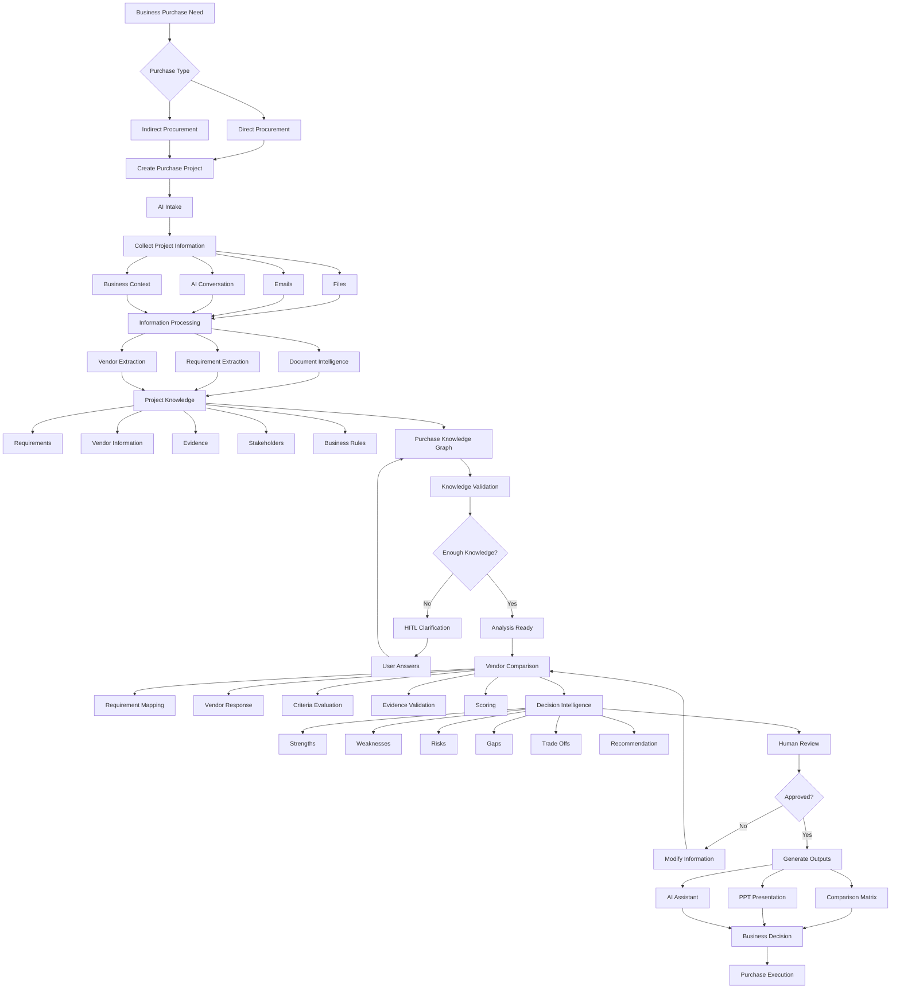
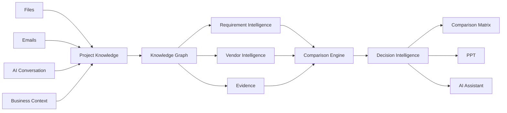

---

# Flow Explanation

## 1. Business Entry

```text
Business Purchase Need
        ↓
Direct / Indirect
        ↓
Purchase Project
```

Direct and indirect procurement have different business processes, but both eventually enter the same AI workspace.

---

## 2. Information Collection

The project can receive information from multiple sources:

```text
             Purchase Project
                    |
       +------------+------------+
       |            |            |
      Files       Emails      AI Chat
       |            |            |
       +------------+------------+
                    |
             Business Context
```

### Main inputs

- PDF
    
- Excel
    
- CSV
    
- PowerPoint
    
- Word
    
- Emails
    
- User conversation
    
- Business-provided information
    

---

# 3. Information Processing

The system converts unstructured information into structured project information.

```text
Files / Emails / Conversation
            |
            v
    Information Processing
            |
     +------+------+------+
     |      |      |      |
 Documents Requirements Vendors Evidence
```

This is where document intelligence, extraction, classification, normalization, and source tracking happen.

---

# 4. Project Knowledge

All information becomes part of the **Purchase Project Knowledge**.

```text
Purchase Knowledge
|
+-- Requirements
|
+-- Vendors
|
+-- Evidence
|
+-- Stakeholders
|
+-- Business Rules
|
+-- Decisions
|
+-- Conversations
```

The **Knowledge Graph** connects these entities.

Example:

```text
Requirement
    |
    +-- defined in --> Document
    |
    +-- discussed in --> Conversation
    |
    +-- answered by --> Vendor
    |
    +-- evaluated by --> Criteria
    |
    +-- supported by --> Evidence
```

---

# 5. Knowledge Validation

The AI checks whether enough information exists to perform a reliable comparison.

```text
Knowledge
   |
   v
Validation
   |
   +-- Missing information
   +-- Ambiguity
   +-- Conflicting information
   +-- Missing vendor response
   +-- Missing requirement
```

When something important is missing:

```text
AI detects uncertainty
        |
        v
AI asks user
        |
        v
User clarifies
        |
        v
Knowledge Graph updated
        |
        v
Validation again
```

This is the main **HITL loop**.

---

# 6. Comparison Intelligence

Once the project is ready:

```text
Requirements
      +
Evaluation Criteria
      +
Vendor Responses
      +
Evidence
      |
      v
Vendor Comparison
```

The comparison engine evaluates each vendor against the purchase requirements.

Example result states:

```text
MEETS
PARTIAL
FAILS
NOT SPECIFIED
NOT APPLICABLE
CONFLICTING
```

---

# 7. Decision Intelligence

The system then produces decision-support information.

```text
Vendor Comparison
       |
       +-- Strengths
       +-- Weaknesses
       +-- Gaps
       +-- Risks
       +-- Trade Offs
       +-- Scores
       +-- Ranking
       +-- Recommendation
```

The recommendation remains **decision support**, not an autonomous procurement decision.

---

# 8. Human Review

The business or procurement user reviews:

- Comparison
    
- Evidence
    
- Scores
    
- Risks
    
- Recommendation
    

The user can modify information or challenge AI findings.

```text
AI Analysis
    |
    v
Human Review
    |
    +---- Reject / Modify ----> Re-analysis
    |
    +---- Approve -----------> Output Generation
```

---

# 9. Core Outputs

The system has three primary outputs.

```text
                 Approved Analysis
                        |
            +-----------+-----------+
            |           |           |
            v           v           v
       Comparison      PPT      AI Assistant
         Matrix      Presentation
```

### Comparison Matrix

Possible formats:

```text
XLSX
CSV
DOCX
```

Contains:

- Vendor comparison
    
- Requirement mapping
    
- Commercial comparison
    
- Technical comparison
    
- Scoring
    
- Ranking
    
- Risks
    
- Evidence references
    

### PPT Presentation

Business-ready presentation containing:

- Purchase overview
    
- Requirements
    
- Vendor comparison
    
- Commercial analysis
    
- Risk analysis
    
- Recommendation
    
- Decision required
    

### AI Assistant

Available throughout the complete journey:

```text
Create
  ↓
Understand
  ↓
Analyze
  ↓
Compare
  ↓
Review
  ↓
Generate
```

The assistant is therefore **not a single step** in the workflow.

It is a **continuous interface over the Purchase Project intelligence**.

---

# Core Architecture Concept



## The product in one sentence

> **Multiple procurement inputs → one Purchase Knowledge Graph → AI-assisted comparison and decision intelligence → business-ready procurement outputs.**