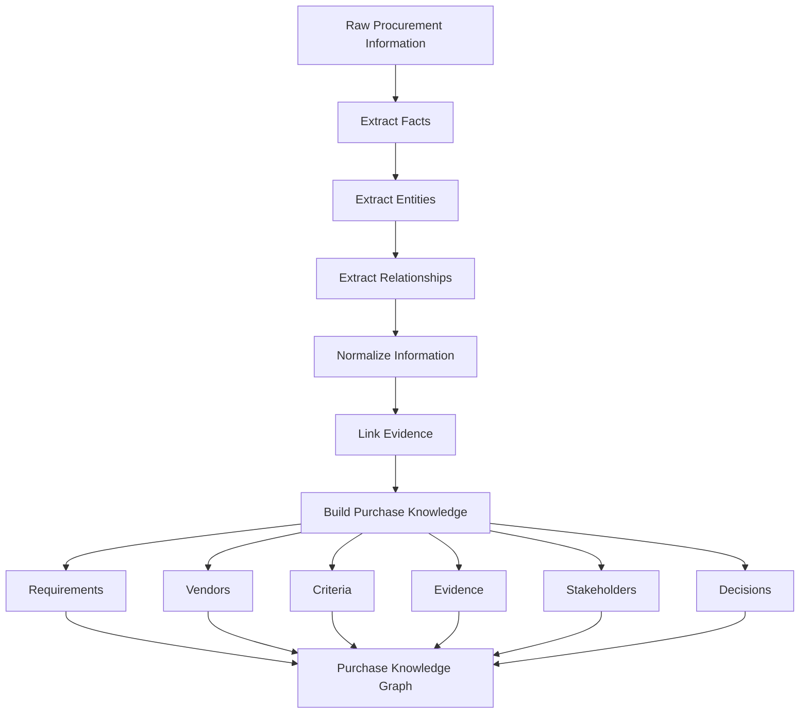
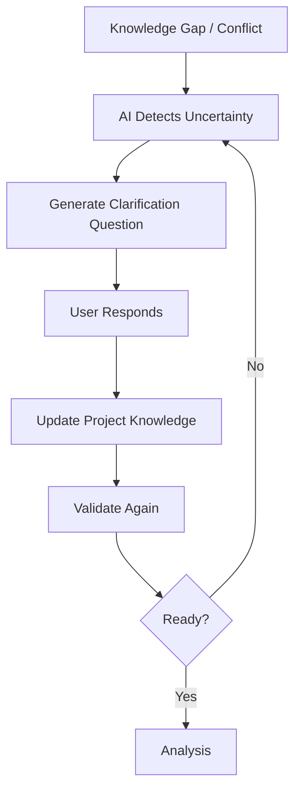
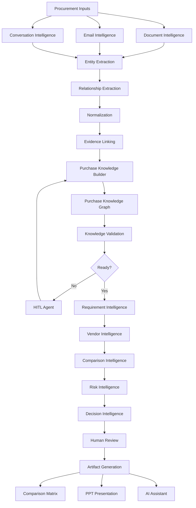

> **Purpose:** Define the intelligence components required to transform fragmented procurement information into structured purchase knowledge, vendor comparison, decision support, and business-ready artifacts.

---

## 1. AI System Overview

```mermaid
flowchart TD

    A[Procurement Information]

    A --> B[Document Intelligence]
    A --> C[Email Intelligence]
    A --> D[Conversation Intelligence]

    B --> E[Entity & Fact Extraction]
    C --> E
    D --> E

    E --> F[Relationship Extraction]
    F --> G[Knowledge Normalization]

    G --> H[Purchase Knowledge Builder]

    H --> I[Purchase Knowledge Graph]

    I --> J[Knowledge Validation]

    J --> K{Knowledge Ready?}

    K -->|No| L[HITL Knowledge Acquisition]
    L --> H

    K -->|Yes| M[Procurement Intelligence]

    M --> N[Requirement Intelligence]
    M --> O[Vendor Intelligence]
    M --> P[Comparison Intelligence]
    M --> Q[Risk Intelligence]
    M --> R[Decision Intelligence]

    N --> S[Decision Model]
    O --> S
    P --> S
    Q --> S
    R --> S

    S --> T[Human Review]

    T --> U[Artifact Generation]

    U --> V[Comparison Matrix]
    U --> W[PPT Presentation]
    U --> X[AI Assistant]
````

---

# 2. Domain Knowledge

The AI system needs a procurement-specific understanding of the business domain.

### Core Procurement Concepts

```text
Purchase
├── Direct Purchase
└── Indirect Purchase

Requirement
├── Business
├── Technical
├── Commercial
├── Compliance
├── Security
├── Operational
└── SLA

Vendor
├── Vendor Profile
├── Proposal
├── Quotation
├── Product / Service
├── Pricing
├── Contract
└── SLA

Evaluation
├── Criteria
├── Weight
├── Score
└── Ranking

Decision
├── Risk
├── Gap
├── Trade-off
├── Recommendation
└── Approval
```

### Domain Knowledge Responsibilities

- Procurement terminology
    
- Vendor terminology
    
- Requirement categories
    
- Evaluation criteria
    
- Procurement rules
    
- Business vocabulary
    
- Synonyms and terminology normalization
    
- Direct vs indirect procurement concepts
    

---

# 3. Document Intelligence

Responsible for understanding heterogeneous procurement documents.

### Supported Inputs

- PDF
    
- Excel / XLSX
    
- CSV
    
- PowerPoint / PPTX
    
- Word / DOCX
    
- Scanned documents
    
- Images
    
- Other business documents
    

### Processing Flow

```text
Document
   ↓
Parsing
   ↓
Structure Detection
   ↓
Document Classification
   ↓
Section Extraction
   ↓
Table Extraction
   ↓
Content Normalization
   ↓
Source Mapping
```

### Components

- Document Parser
    
- Layout Parser
    
- Table Extractor
    
- Section Extractor
    
- OCR Adapter
    
- Document Classifier
    
- Metadata Extractor
    
- Source Locator
    

### Output

```text
Structured Document
├── Metadata
├── Sections
├── Paragraphs
├── Tables
├── Content
└── Source References
```

---

# 4. Entity & Fact Extraction

Converts unstructured procurement content into structured entities and facts.

### Core Entities

```text
Vendor
Requirement
Product
Service
Price
Currency
Quantity
SLA
Contract
Date
Location
Stakeholder
Compliance Standard
Risk
Evaluation Criteria
```

### Example

```text
Source:

"Vendor ABC provides 24/7 support with
a critical response time of 4 hours
for €420,000 annually."

↓

Vendor
= Vendor ABC

Service
= 24/7 Support

SLA
= 4 hours

Price
= €420,000

Billing Period
= Annual
```

---

# 5. Relationship Extraction

Entities alone are not sufficient.

The system must understand how entities relate to each other.

```text
Vendor
├── submitted → Proposal
├── offers → Service
├── quoted → Price
├── provides → SLA
└── responded_to → Requirement

Requirement
├── defined_in → Document
├── discussed_in → Conversation
├── evaluated_by → Criteria
└── answered_by → Vendor

Comparison
├── compares → Vendor + Requirement
├── supported_by → Evidence
└── produces → Score
```

This relationship layer becomes the foundation of the Purchase Knowledge Graph.

---

# 6. Knowledge Normalization

Different sources and vendors can describe the same information differently.

The system converts them into a canonical representation.

### Example

```text
Vendor A:
"4-hour response"

Vendor B:
"Critical incidents within 240 minutes"

Vendor C:
"Response SLA: 0.167 days"

↓

Canonical Representation

SLA Response Time
= 4 hours
```

### Normalization Areas

- Units
    
- Currency
    
- Dates
    
- Time periods
    
- Product names
    
- Service names
    
- Requirement terminology
    
- SLA terminology
    
- Commercial terms
    
- Vendor terminology
    

---

# 7. Purchase Knowledge Builder

> **Core component responsible for creating the structured intelligence model of a purchase.**

### Inputs

```text
Documents
Emails
AI Conversations
Business Context
Vendor Information
Historical Procurement Data
```

### Flow



---

# 8. Purchase Knowledge Graph

The Purchase Knowledge Graph represents the complete context of a procurement project.

### Core Nodes

```text
Purchase
Requirement
Evaluation Criteria
Vendor
Proposal
Quotation
Product / Service
Pricing
SLA
Contract
Stakeholder
Document
Email
Conversation
Evidence
Risk
Score
Recommendation
Decision
```

### Example Graph

```text
                    Purchase
                        |
        +---------------+---------------+
        |               |               |
   Requirement        Vendor        Stakeholder
        |               |
        |            Proposal
        |               |
     Criteria        Pricing
        |               |
        +-------+-------+
                |
             Evidence
                |
             Document
                |
             Decision
```

### Key Relationships

```text
Purchase HAS_REQUIREMENT Requirement

Purchase HAS_VENDOR Vendor

Purchase HAS_DOCUMENT Document

Requirement EVALUATED_BY Criteria

Vendor SUBMITTED Proposal

Vendor RESPONDS_TO Requirement

Proposal CONTAINS Pricing

Comparison SUPPORTED_BY Evidence

Risk RELATES_TO Vendor

Recommendation BASED_ON Comparison

Decision BASED_ON Recommendation
```

---

# 9. Evidence Intelligence

Every important AI-generated fact or conclusion should remain traceable to source evidence.

```text
Source
  ↓
Extracted Fact
  ↓
Normalized Fact
  ↓
Requirement Mapping
  ↓
Comparison Result
  ↓
Score
  ↓
Recommendation
  ↓
Decision
```

### Example

```text
Vendor B
   |
   └── SLA = 8 hours
          |
          └── Evidence
                 |
                 └── Vendor_B_SLA.pdf
                        |
                        └── Page 12
```

This allows the user to ask:

> **Why did Vendor B fail this requirement?**

and receive the result together with the supporting source.

---

# 10. Knowledge Validation

Before analysis, the system must determine whether the project knowledge is sufficiently complete and reliable.

### Validation Checks

- Missing requirements
    
- Missing vendor responses
    
- Missing evaluation criteria
    
- Conflicting information
    
- Ambiguous information
    
- Duplicate entities
    
- Low-confidence extraction
    
- Missing evidence
    
- Incomplete vendor information
    

```text
Purchase Knowledge
        ↓
Validation
        |
        +-- Complete?
        +-- Consistent?
        +-- Traceable?
        +-- Sufficient?
```

---

# 11. HITL Knowledge Acquisition

The system should not guess when critical information is missing or conflicting.



### Example

> The requirement document specifies a 4-hour SLA, while the latest vendor email specifies 8 hours. Which value should govern the comparison?

This creates a controlled **AI → Human → Knowledge** feedback loop.

---

# 12. Requirement Intelligence

Transforms raw business information into evaluation-ready requirements.

```text
Raw Requirement
      ↓
Requirement Extraction
      ↓
Normalization
      ↓
Classification
      ↓
Priority
      ↓
Evaluation Criteria
```

### Requirement Categories

- Business
    
- Technical
    
- Commercial
    
- Compliance
    
- Security
    
- Operational
    
- SLA
    
- Implementation
    

### Priority

```text
Mandatory
Preferred
Informational
```

---

# 13. Vendor Intelligence

Builds a normalized intelligence model for every vendor.

```text
Vendor Sources
      ↓
Vendor Identification
      ↓
Vendor Profile
      ↓
Proposal Extraction
      ↓
Pricing Extraction
      ↓
SLA Extraction
      ↓
Compliance Extraction
      ↓
Requirement Responses
      ↓
Vendor Intelligence
```

---

# 14. Comparison Intelligence

Compares vendors against structured requirements and evaluation criteria.

```text
Requirement
+
Evaluation Criteria
+
Vendor Response
+
Evidence
+
Business Rules
        ↓
Comparison Result
```

### Comparison States

```text
MEETS
PARTIAL
FAILS
NOT SPECIFIED
NOT APPLICABLE
CONFLICTING
```

Important:

> **NOT SPECIFIED ≠ FAIL**

The system must preserve the distinction between missing information and an explicit negative response.

---

# 15. Decision Intelligence

Converts comparison results into decision-support information.

```text
Comparison
   |
   +-- Strengths
   +-- Weaknesses
   +-- Gaps
   +-- Risks
   +-- Trade-offs
   +-- Scores
   +-- Ranking
   +-- Recommendation
```

The AI provides **evidence-backed decision support**.

The final procurement decision remains with the authorized human stakeholders.

---

# 16. Agent Layer

The agent layer orchestrates the intelligence capabilities.

### Knowledge-Building Agents

```text
Document Agent
Entity Extraction Agent
Relationship Agent
Requirement Agent
Vendor Extraction Agent
Normalization Agent
Evidence Agent
Knowledge Builder Agent
Knowledge Validation Agent
HITL Agent
```

### Decision Agents

```text
Comparison Agent
Scoring Agent
Risk Agent
Recommendation Agent
Decision Support Agent
```

### Artifact Agents

```text
Comparison Matrix Agent
Excel Agent
PPT Agent
Report Agent
```

### Orchestration

```text
                    Orchestrator
                         |
        +----------------+----------------+
        |                |                |
        ↓                ↓                ↓
 Knowledge Agents   Decision Agents   Artifact Agents
        |                |                |
        +----------------+----------------+
                         |
                 Purchase Intelligence
```

---

# 17. Core AI System Flow



---

# 18. Architectural Principle

The system should follow this fundamental sequence:

```text
INGEST
  ↓
UNDERSTAND
  ↓
STRUCTURE
  ↓
NORMALIZE
  ↓
CONNECT
  ↓
VALIDATE
  ↓
REASON
  ↓
DECIDE
  ↓
GENERATE
```

Or, more specifically:

> **Raw Procurement Data → Purchase Knowledge → Procurement Intelligence → Decision Support → Business Artifacts**

---

# 19. Core Building Blocks

| Building Block             | Primary Responsibility                 |
| -------------------------- | -------------------------------------- |
| Domain Knowledge           | Understand procurement concepts        |
| Document Intelligence      | Understand source documents            |
| Entity Extraction          | Extract procurement entities           |
| Relationship Extraction    | Connect entities                       |
| Normalization              | Create comparable facts                |
| Purchase Knowledge Builder | Construct project intelligence         |
| Knowledge Graph            | Represent connected purchase knowledge |
| Evidence Intelligence      | Maintain source traceability           |
| Knowledge Validation       | Assess quality and completeness        |
| HITL Agent                 | Resolve uncertainty with users         |
| Requirement Intelligence   | Structure requirements                 |
| Vendor Intelligence        | Structure vendor information           |
| Comparison Intelligence    | Compare vendors                        |
| Risk Intelligence          | Identify risks and gaps                |
| Decision Intelligence      | Produce decision support               |
| Artifact Agents            | Generate Excel/PPT/report outputs      |
| Orchestrator               | Control agent execution                |

---

# 20. Core Mental Model

```text
                 PROCUREMENT DOMAIN
                        |
                        ↓
               DOMAIN KNOWLEDGE
                        |
                        ↓
              DOCUMENT INTELLIGENCE
                        |
                        ↓
        ENTITY + RELATIONSHIP EXTRACTION
                        |
                        ↓
                 NORMALIZATION
                        |
                        ↓
            PURCHASE KNOWLEDGE BUILDER
                        |
                        ↓
             PURCHASE KNOWLEDGE GRAPH
                        |
                        ↓
                 KNOWLEDGE VALIDATION
                        |
                 +------+------+
                 |             |
              Incomplete     Complete
                 |             |
                 ↓             ↓
               HITL       INTELLIGENCE
                 |             |
                 +------→------+
                               |
             +-----------------+----------------+
             |                 |                |
             ↓                 ↓                ↓
       Requirement         Vendor          Evidence
       Intelligence       Intelligence    Intelligence
             |                 |                |
             +-----------------+----------------+
                               |
                               ↓
                    COMPARISON INTELLIGENCE
                               |
                               ↓
                     DECISION INTELLIGENCE
                               |
                               ↓
                         HUMAN DECISION
                               |
                  +------------+------------+
                  |            |            |
                  ↓            ↓            ↓
                Excel          PPT       AI Assistant
```

### North Star

> **Build trustworthy Purchase Knowledge first. Then reason over it. Then generate the procurement decision artifacts.**