> **Business workflow drives orchestration; agents perform bounded intelligence; deterministic services perform computation; the Purchase Intelligence Model maintains shared state.**

# Agent System Architecture

> [!abstract] Purpose
> AI-native procurement system for Direct and Indirect purchasing.
>
> The system converts fragmented purchase information into:
> - structured procurement knowledge
> - evidence-backed vendor comparison
> - risk and trade-off analysis
> - human-approved recommendation
> - Excel comparison matrix
> - executive presentation

---

## 01 — Architecture Principle

The architecture is **not**:

> [!abstract] Purpose
`User → LLM → Answer`
>
It is:
>
`Business Process → Orchestration → Agent Intelligence → Knowledge → Decision → HITL → Business Artifact`


### Core principle

```text
Business Workflow
       ↓
Purchase State
       ↓
Procurement Controller
       ↓
Specialist Agents
       ↓
Shared Purchase Intelligence
       ↓
Decision Intelligence
       ↓
Human Approval
       ↓
Business Artifacts
````

---

# 02 — System Context

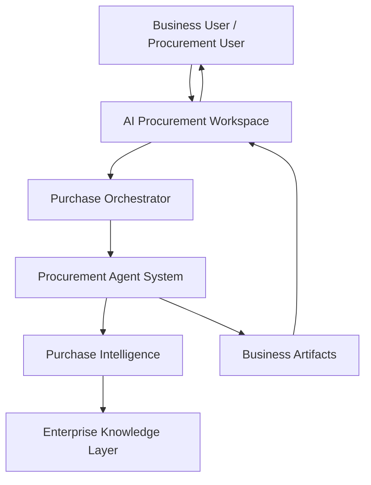

### Developer interpretation

- `AI Procurement Workspace`
    
    - UI
        
    - project workspace
        
    - chat
        
    - document viewer
        
    - comparison matrix
        
    - graph visualization
        
    - approval actions
        
- `Purchase Orchestrator`
    
    - controls workflow
        
    - manages project state
        
    - decides which agent should execute
        
    - manages HITL
        
    - validates stage transitions
        
- `Procurement Agent System`
    
    - performs domain reasoning
        
    - does not own persistent project state
        
- `Purchase Intelligence`
    
    - canonical project state
        
    - shared context between agents
        
- `Enterprise Knowledge Layer`
    
    - documents
        
    - structured data
        
    - graph
        
    - vector retrieval
        
    - evidence
        

---

# 03 — Direct vs Indirect Procurement

Direct and indirect purchasing should **not** become two independent agent systems.

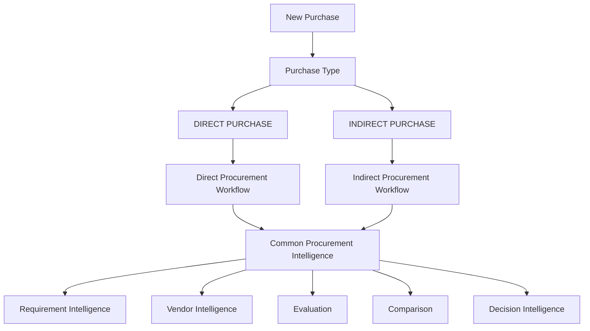

### Key architecture decision

```text
Workflow = configurable

Intelligence = shared

Decision model = shared

Artifacts = shared
```

Direct and indirect procurement can therefore have different:

- intake questions
    
- required documents
    
- approval stages
    
- evaluation criteria
    
- procurement policies
    

while sharing:

- document intelligence
    
- knowledge construction
    
- evidence management
    
- vendor normalization
    
- comparison
    
- risk analysis
    
- recommendation
    
- artifact generation
    

---

# 04 — Complete Agent System

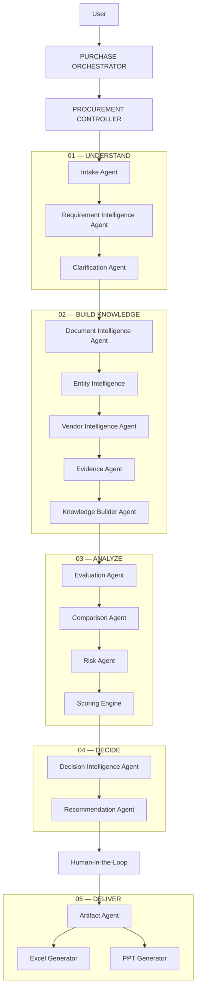

---

# 05 — Why These Agents Exist

|Agent|Business responsibility|Primary output|
|---|---|---|
|**Purchase Orchestrator**|Manage purchase lifecycle|workflow state|
|**Procurement Controller**|Control quality, policy and stage transitions|validated state|
|**Intake Agent**|Understand business need|purchase context|
|**Requirement Agent**|Convert business need into requirements|structured requirements|
|**Clarification Agent**|Resolve ambiguity|confirmed knowledge|
|**Document Agent**|Understand uploaded documents|structured document data|
|**Entity Intelligence**|Identify vendors, products, requirements, people, etc.|entities|
|**Vendor Agent**|Build comparable vendor profiles|vendor intelligence|
|**Evidence Agent**|Trace facts to sources|evidence|
|**Knowledge Builder**|Maintain project knowledge|knowledge graph|
|**Evaluation Agent**|Evaluate vendor against criteria|evaluation|
|**Comparison Agent**|Identify differences and trade-offs|comparison|
|**Risk Agent**|Detect commercial/technical/process risks|risk register|
|**Scoring Engine**|Calculate deterministic scores|scores|
|**Decision Agent**|Synthesize decision context|decision analysis|
|**Recommendation Agent**|Produce decision recommendation|recommendation|
|**Artifact Agent**|Convert decision model into outputs|artifacts|

---

# 06 — The Most Important Component: Purchase Intelligence

Agents should **not communicate primarily by passing huge prompts to each other**.

They should communicate through a shared structured project state.

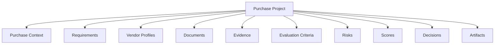

Think of this as:

> **The Purchase Project is the source of truth.**

Agents operate on this state.

---

# 07 — Purchase Intelligence Model

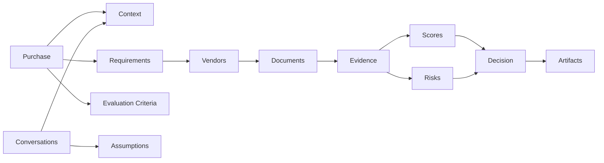

---

# 08 — Agent vs Service Boundary

Do **not** make everything an agent.

This is important for production architecture.

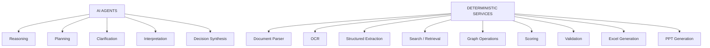

### Rule

> **Use an agent where reasoning or adaptive planning is required.**

> **Use a deterministic service where the operation is predictable.**

---

# 09 — Purchase Orchestrator

The orchestrator is responsible for the **workflow**, not domain reasoning.

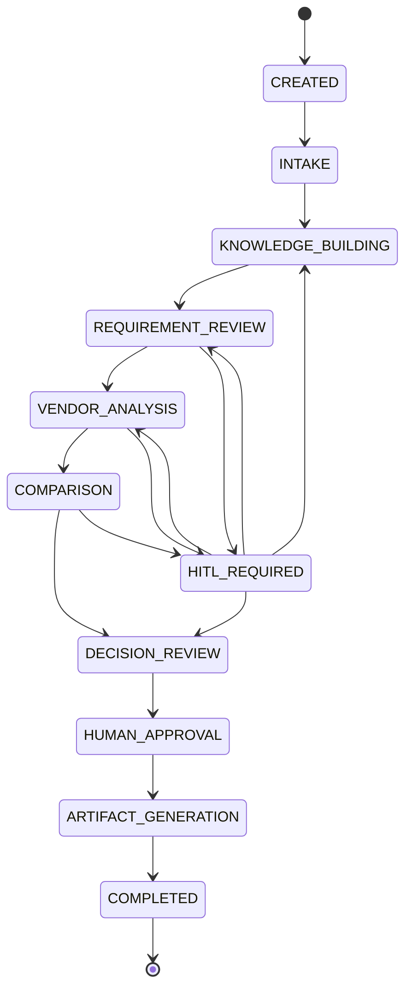

The orchestrator should know:

```text
What stage are we in?

What information is missing?

Which agent should execute?

Is HITL required?

Can the workflow move forward?

What output is expected from the current stage?
```

---

# 10 — Procurement Controller

The controller sits above individual agents.

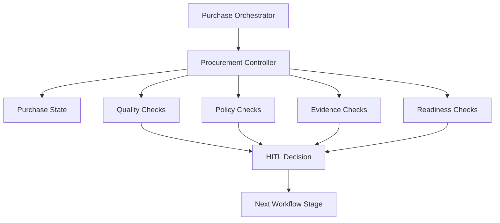

### Controller asks

```text
Are requirements complete?

Are mandatory requirements identified?

Are vendor responses sufficiently covered?

Are critical comparison cells backed by evidence?

Are evaluation criteria defined?

Are unresolved conflicts present?

Is human approval required?

Can the project move forward?
```

---

# 11 — Intake Agent

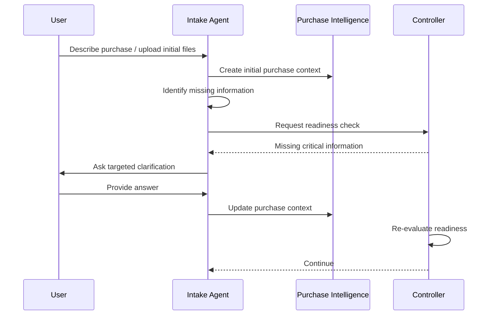

### Important

The agent should **not** ask every possible procurement question.

It should ask only questions where:

```text
uncertainty × business impact
```

is high.

---

# 12 — Requirement Intelligence

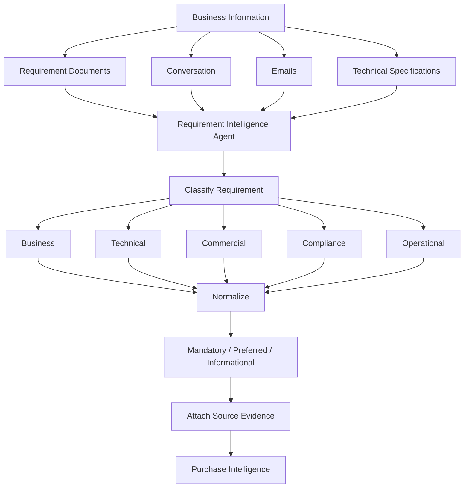

---

# 13 — Document Intelligence

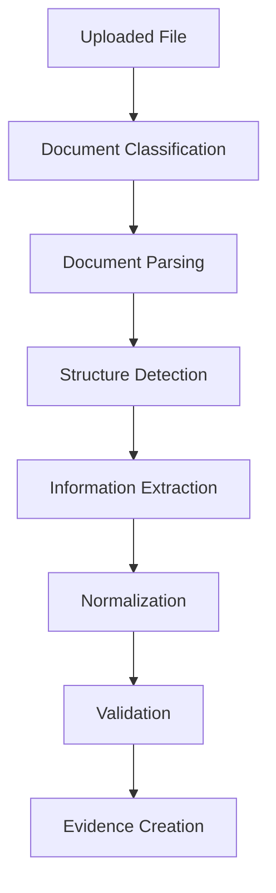

### Supported document types

```text
PDF
DOCX
XLSX
CSV
PPTX
Email
Images / scanned documents
```

The output should **not simply be text chunks**.

It should produce structured procurement information.

---

# 14 — Vendor Intelligence Agent

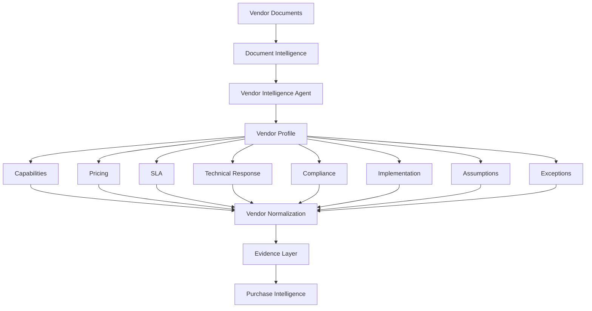

---

# 15 — Evidence Architecture

This should be treated as a first-class system capability.

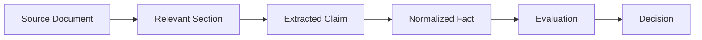

Example:

```text
Vendor_B_SLA.pdf
        ↓
Page 14
        ↓
"Response within 8 business hours"
        ↓
sla_response_time = 8 hours
        ↓
Requirement = <= 4 hours
        ↓
FAIL
        ↓
Vendor B SLA Risk
```

This creates the traceability chain:

```text
Decision
   ↓
Evaluation
   ↓
Fact
   ↓
Claim
   ↓
Source
```

---

# 16 — Knowledge Builder

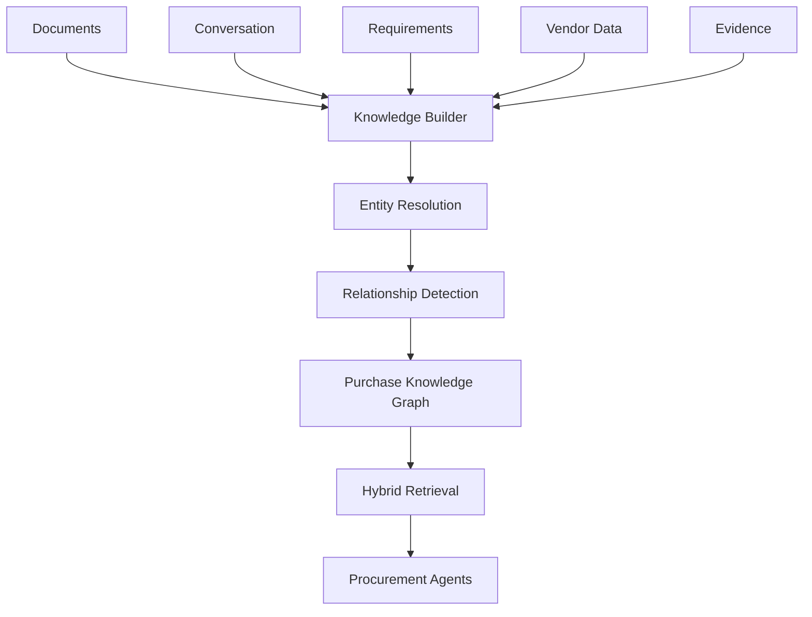

---

# 17 — Hybrid Knowledge Architecture

Do not rely exclusively on Graph RAG.

Use three complementary representations.

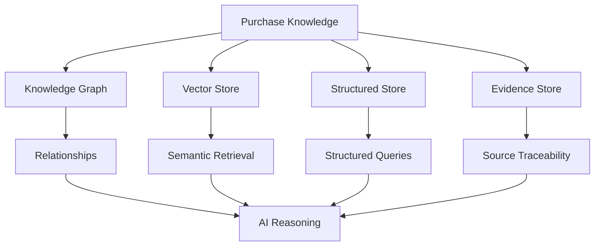

### Each store has a different job

|Layer|Purpose|
|---|---|
|Graph|relationships|
|Vector|semantic retrieval|
|SQL|exact structured data|
|Evidence|traceability|

---

# 18 — Evaluation Agent

This is where requirements and vendors meet.

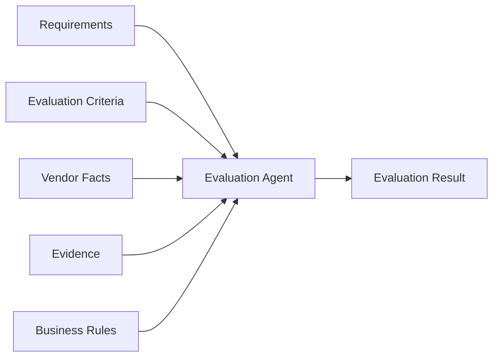

Possible result states:

```text
MEETS
PARTIAL
FAILS
NOT_SPECIFIED
NOT_APPLICABLE
CONFLICTING
```

---

# 19 — Deterministic Scoring

LLM reasoning should not directly determine numerical scores.

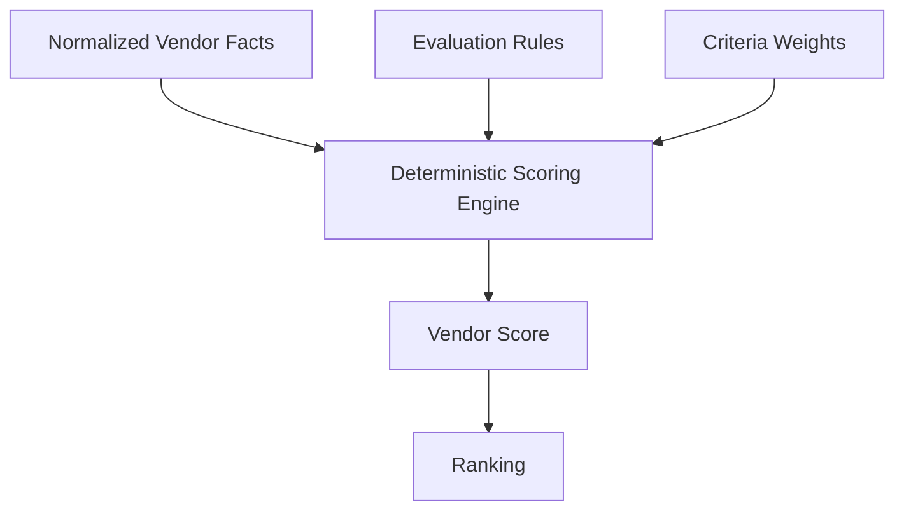

Example:

```text
Technical       40%
Commercial      30%
Risk            20%
Compliance      10%

              ↓

Deterministic Score

              ↓

Vendor Ranking
```

---

# 20 — Comparison Agent

The comparison agent should answer:

```text
What is different?

Why is it different?

Is the difference important?

What is the business impact?

What evidence supports the difference?
```

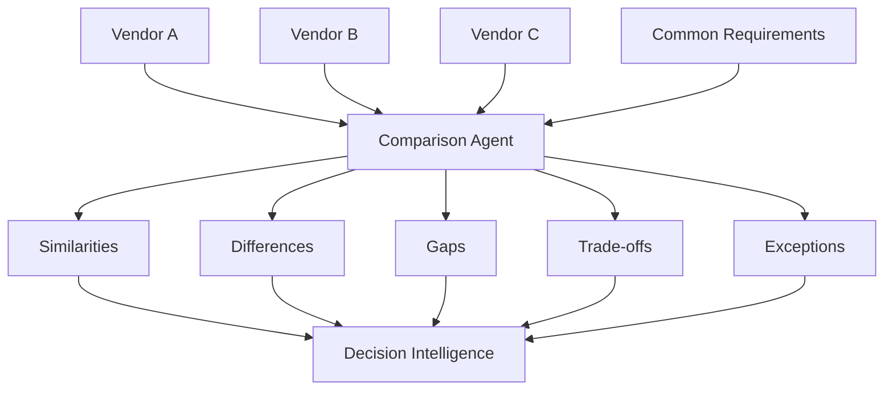

---

# 21 — Risk Agent

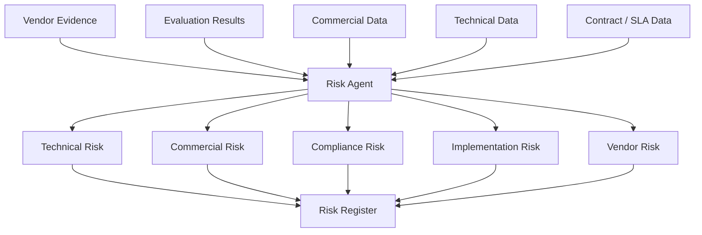

---

# 22 — Decision Intelligence

This is the highest-level reasoning layer.

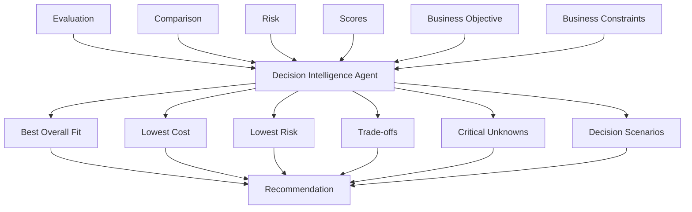

The system should say:

> **Vendor A is the strongest overall fit.**

rather than pretending:

> **AI selected Vendor A.**

---

# 23 — Human-in-the-Loop

HITL should exist at specific decision gates.

```mermaid
flowchart TD

    AI["AI Analysis"]

    CHECK["Controller"]

    AUTO["Continue Automatically"]

    HITL["Human Review"]

    APPROVE["Approve"]

    MODIFY["Modify"]

    REJECT["Reject"]

    AI --> CHECK

    CHECK --> AUTO
    CHECK --> HITL

    HITL --> APPROVE
    HITL --> MODIFY
    HITL --> REJECT

    MODIFY --> AI
    APPROVE --> NEXT["Next Stage"]
    REJECT --> REWORK["Rework"]
```

### HITL triggers

```text
Critical requirement ambiguity
        OR
Conflicting vendor information
        OR
Missing critical evidence
        OR
Policy violation
        OR
Low confidence
        OR
Final recommendation
        OR
Final artifact approval
```

---

# 24 — Final Decision Model

Everything eventually converges here.

```mermaid
flowchart TD

    PROJECT["Purchase"]

    REQ["Requirements"]
    CRITERIA["Criteria"]
    VENDOR["Vendor Intelligence"]
    EVIDENCE["Evidence"]
    SCORE["Scores"]
    RISK["Risks"]
    COMP["Comparison"]

    DECISION["Purchase Decision Model"]

    PROJECT --> DECISION
    REQ --> DECISION
    CRITERIA --> DECISION
    VENDOR --> DECISION
    EVIDENCE --> DECISION
    SCORE --> DECISION
    RISK --> DECISION
    COMP --> DECISION

    DECISION --> RECOMMEND["Recommendation"]

    RECOMMEND --> HUMAN["Human Decision"]

    HUMAN --> FINAL["Approved Decision"]
```

---

# 25 — Artifact Generation

Artifacts should be **rendered from the Decision Model**, not independently generated by separate agents.

```mermaid
flowchart TD

    DECISION["Approved Decision Model"]

    ARTIFACT["Artifact Agent"]

    EXCEL["Comparison Matrix"]
    PPT["Executive Presentation"]

    DECISION --> ARTIFACT

    ARTIFACT --> EXCEL
    ARTIFACT --> PPT
```

### Excel

```text
Executive Summary
Requirements Matrix
Vendor Comparison
Technical Evaluation
Commercial Evaluation
Risk Assessment
Scoring
Evidence References
```

### PPT

```text
Purchase Overview
Business Requirements
Vendor Landscape
Comparison
Commercial Analysis
Risk
Trade-offs
Recommendation
Decision Required
```

---

# 26 — Complete End-to-End Agent Graph

```mermaid
flowchart TD

    USER["Business User"]

    APP["Procurement Workspace"]

    ORCH["Purchase Orchestrator"]

    CTRL["Procurement Controller"]

    INTAKE["Intake Agent"]

    REQ["Requirement Agent"]

    CLARIFY["Clarification Agent"]

    DOC["Document Intelligence"]

    VENDOR["Vendor Intelligence"]

    EVIDENCE["Evidence Agent"]

    KB["Knowledge Builder"]

    EVAL["Evaluation Agent"]

    COMP["Comparison Agent"]

    RISK["Risk Agent"]

    SCORE["Scoring Engine"]

    DECISION["Decision Intelligence"]

    RECOMMEND["Recommendation"]

    HITL["Human Approval"]

    ART["Artifact Agent"]

    EXCEL["Excel"]

    PPT["PPT"]

    USER --> APP
    APP --> ORCH
    ORCH --> CTRL

    CTRL --> INTAKE

    INTAKE --> REQ
    REQ --> CLARIFY

    CLARIFY --> DOC
    DOC --> VENDOR
    VENDOR --> EVIDENCE

    EVIDENCE --> KB

    KB --> EVAL

    EVAL --> COMP
    COMP --> RISK
    RISK --> SCORE

    SCORE --> DECISION
    COMP --> DECISION
    RISK --> DECISION

    DECISION --> RECOMMEND

    RECOMMEND --> HITL

    HITL --> ART

    ART --> EXCEL
    ART --> PPT

    EXCEL --> APP
    PPT --> APP
```

---

# 27 — Runtime Architecture

The logical agent graph sits on top of runtime infrastructure.

```mermaid
flowchart TD

    UI["Web Application"]

    API["Application API"]

    ORCH["Agent Orchestrator"]

    AGENT["Agent Runtime"]

    TOOLS["Tool Layer"]

    KNOW["Knowledge Layer"]

    DATA["Enterprise Data"]

    UI --> API
    API --> ORCH

    ORCH --> AGENT

    AGENT --> TOOLS
    AGENT --> KNOW

    TOOLS --> DATA
```

### Tool layer

```text
Document Parser
Search
Retrieval
Database
Graph Query
Calculator
Scoring
Excel
PPT
Validation
```

---

# 28 — Agent Tool Access

Agents should have **bounded tools**.

```mermaid
flowchart LR

    INTAKE["Intake Agent"]
    REQ["Requirement Agent"]
    VENDOR["Vendor Agent"]
    EVAL["Evaluation Agent"]
    DECISION["Decision Agent"]

    INTAKE --> T1["Project Context Tool"]

    REQ --> T2["Document Search"]
    REQ --> T3["Requirement Store"]

    VENDOR --> T4["Vendor Document Search"]
    VENDOR --> T5["Vendor Store"]

    EVAL --> T6["Evidence Retrieval"]
    EVAL --> T7["Scoring Engine"]

    DECISION --> T8["Comparison Store"]
    DECISION --> T9["Risk Store"]
```

This is important for:

- security
    
- debugging
    
- observability
    
- cost control
    
- predictable behavior
    
- least-privilege access
    

---

# 29 — Observability

Every agent action should produce an execution record.

```mermaid
flowchart TD

    AGENT["Agent Execution"]

    TRACE["Trace"]

    INPUT["Input Context"]
    TOOL["Tool Calls"]
    OUTPUT["Output"]
    EVIDENCE["Evidence Used"]
    CONF["Confidence"]
    COST["Token / Cost"]
    TIME["Latency"]

    AGENT --> TRACE

    TRACE --> INPUT
    TRACE --> TOOL
    TRACE --> OUTPUT
    TRACE --> EVIDENCE
    TRACE --> CONF
    TRACE --> COST
    TRACE --> TIME
```

This becomes extremely important when someone asks:

> “Why did the AI say Vendor B failed?”

You should be able to reconstruct the execution.

---

# 30 — Final Architecture Mental Model

The entire system can be reduced to:

```text
                         USER
                           │
                           ▼
                ┌─────────────────────┐
                │ PROCUREMENT WORKSPACE│
                └──────────┬──────────┘
                           │
                           ▼
                ┌─────────────────────┐
                │ PURCHASE ORCHESTRATOR│
                └──────────┬──────────┘
                           │
                           ▼
                ┌─────────────────────┐
                │ PROCUREMENT CONTROLLER│
                └──────────┬──────────┘
                           │
       ┌───────────────────┼───────────────────┐
       │                   │                   │
       ▼                   ▼                   ▼
   UNDERSTAND           KNOWLEDGE           ANALYZE
       │                   │                   │
   Intake              Documents          Evaluation
   Requirements        Vendors             Comparison
   Clarification       Evidence            Risk
                       Graph               Scoring
       │                   │                   │
       └───────────────────┼───────────────────┘
                           │
                           ▼
                 DECISION INTELLIGENCE
                           │
                           ▼
                    HUMAN APPROVAL
                           │
                           ▼
                     DECISION MODEL
                           │
                 ┌─────────┴─────────┐
                 ▼                   ▼
              EXCEL                 PPT
```

---

# 31 — The Core Architecture Rule

> [!important]  
> **Agents are not the architecture.**
> 
> The **Purchase Intelligence + Procurement State Machine + Controller** are the architecture.
> 
> Agents are reasoning components operating inside that architecture.

This distinction will make the eventual implementation much cleaner.

---

# 32 — Recommended Agent Hierarchy

```text
PROCUREMENT AI SYSTEM
│
├── ORCHESTRATION
│   ├── Purchase Orchestrator
│   └── Procurement Controller
│
├── UNDERSTANDING
│   ├── Intake Agent
│   ├── Requirement Agent
│   └── Clarification Agent
│
├── KNOWLEDGE
│   ├── Document Intelligence
│   ├── Vendor Intelligence
│   ├── Evidence Agent
│   └── Knowledge Builder
│
├── DECISION INTELLIGENCE
│   ├── Evaluation Agent
│   ├── Comparison Agent
│   ├── Risk Agent
│   ├── Scoring Engine
│   └── Decision Intelligence Agent
│
└── DELIVERY
    ├── Artifact Agent
    ├── Excel Generator
    └── PPT Generator
```

The **next architecture document I would create after this is not another agent diagram**. It should be the **`Purchase Intelligence Data Model`** — showing the exact entities, states, relationships, evidence objects, agent inputs/outputs, and how the Graph + SQL + Vector layers represent one purchase. That will give developers the concrete contract they need to implement this agent graph.