Below is the **application-only architecture/flow** — no agent architecture, no backend implementation. I would use this as the **Product / Application Flow** page in Obsidian.

The design principle is:

> **Dashboard → Purchase → AI Intake → Knowledge Building → Analysis → Comparison → Decision → Deliverables**

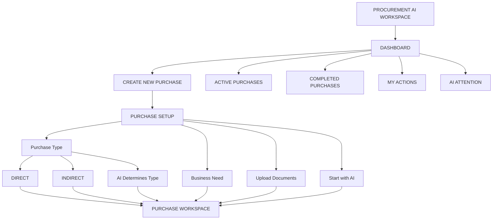

---

# 01 — Application Navigation

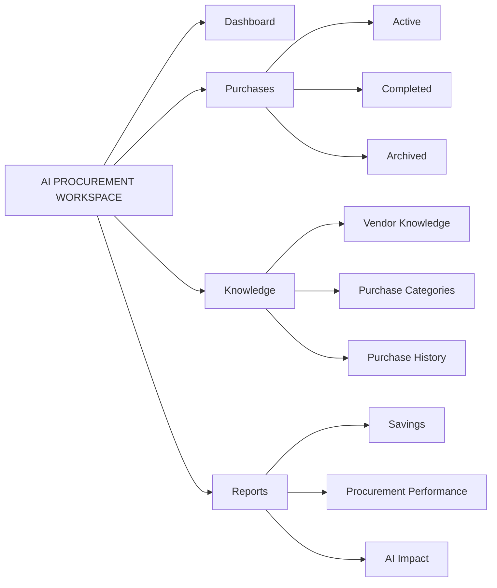

The primary navigation should remain simple:

```text
Dashboard
Purchases
Knowledge
Reports
```

Everything else lives inside the purchase workspace.

---

# 02 — Dashboard

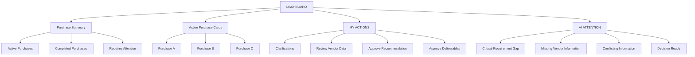

---

# 03 — New Purchase

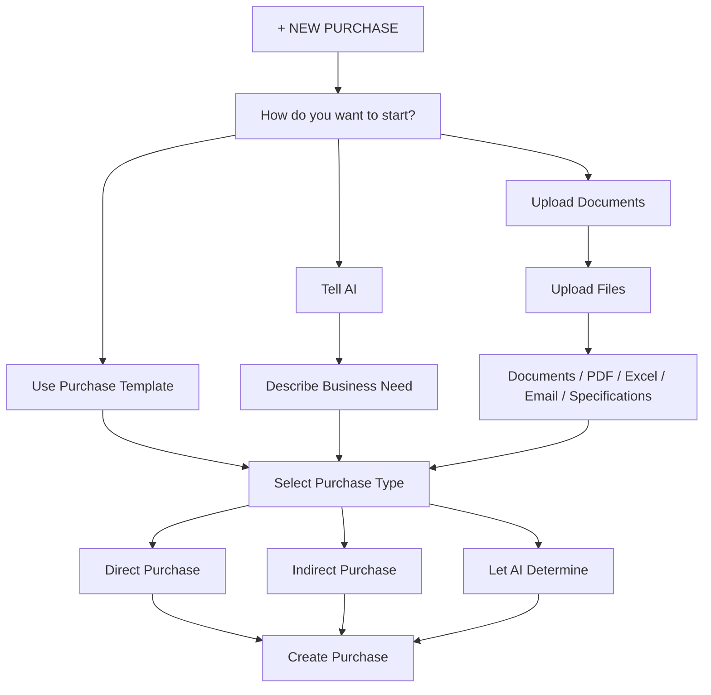

---

# 04 — AI Intake

This is the first major AI experience from the user's perspective.

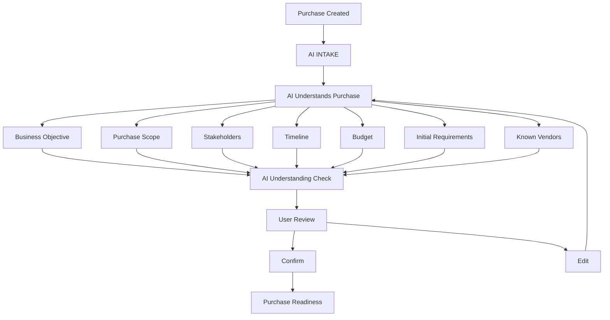

---

# 05 — Purchase Readiness

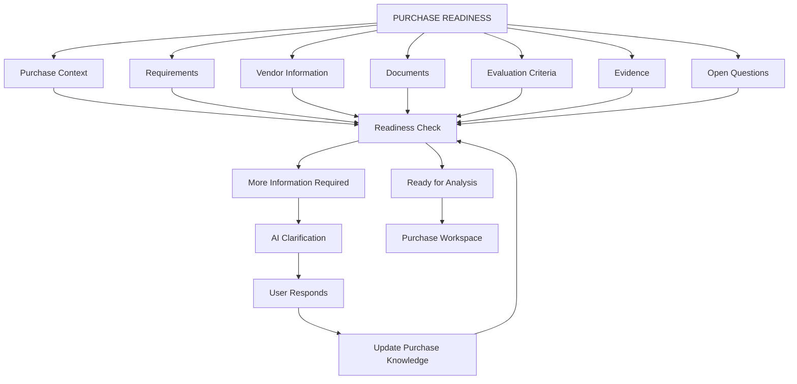

---

# 06 — Purchase Workspace

This is the **main application screen**.

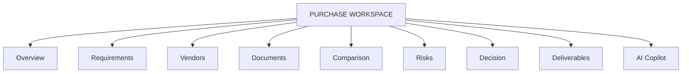

---

# 07 — Workspace Layout

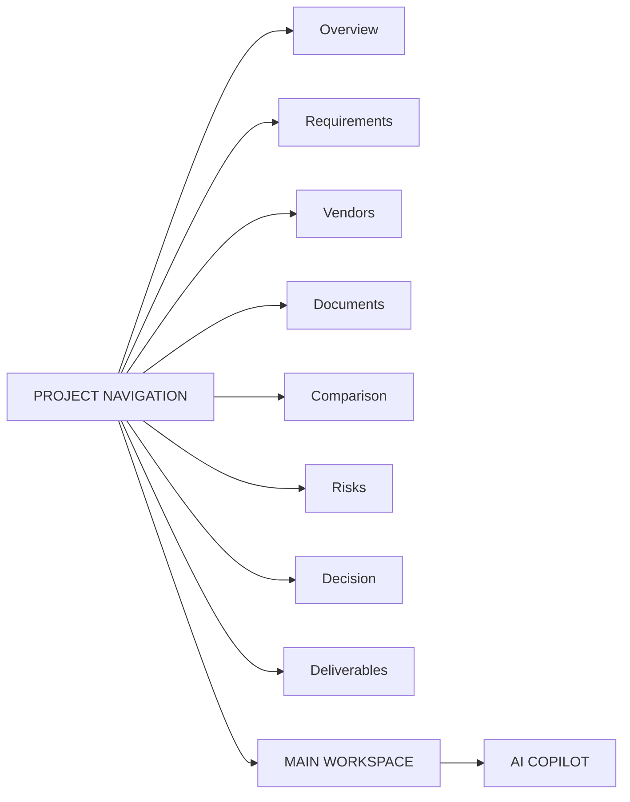

Visually:

```text
┌─────────────────────────────────────────────────────────────┐
│ Purchase Name                              Readiness: 87%   │
│                                                             │
│ Understand → Prepare → Compare → Decide → Deliver          │
├───────────────┬─────────────────────────────┬───────────────┤
│               │                             │               │
│ PROJECT       │                             │ AI COPILOT    │
│               │       MAIN WORKSPACE        │               │
│ Overview      │                             │ Ask about     │
│ Requirements  │                             │ this purchase │
│ Vendors       │                             │               │
│ Documents     │                             │ AI Findings   │
│ Comparison    │                             │ Actions       │
│ Risks         │                             │               │
│ Decision      │                             │               │
│ Deliverables  │                             │               │
│               │                             │               │
└───────────────┴─────────────────────────────┴───────────────┘
```

---

# 08 — Purchase Journey

This should be visible throughout the project.

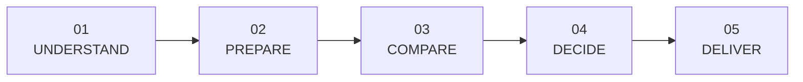

---

# 09 — Understand

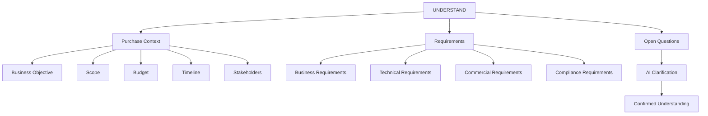

---

# 10 — Prepare

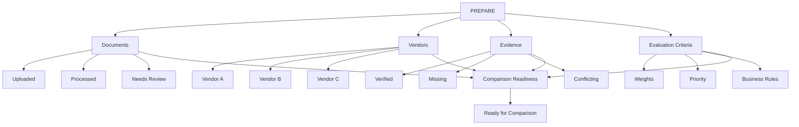

---

# 11 — Requirements Experience

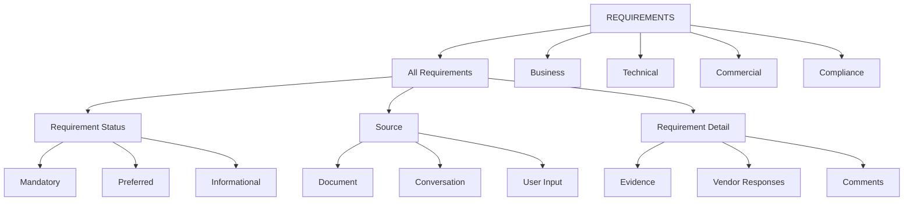

---

# 12 — Vendor Experience

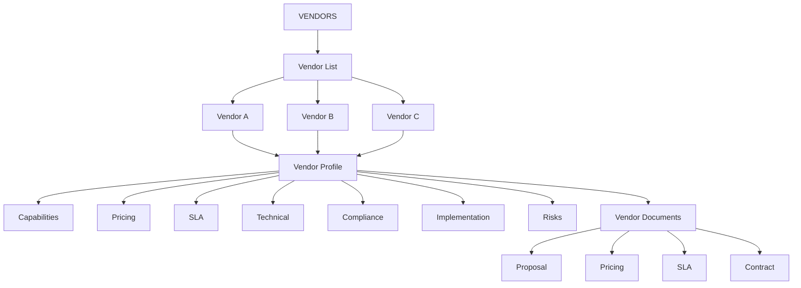

---

# 13 — Comparison Experience

This is the **core business screen**.

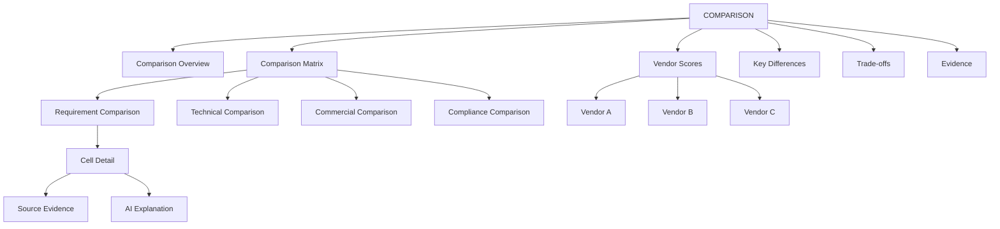

---

# 14 — Comparison Matrix Interaction

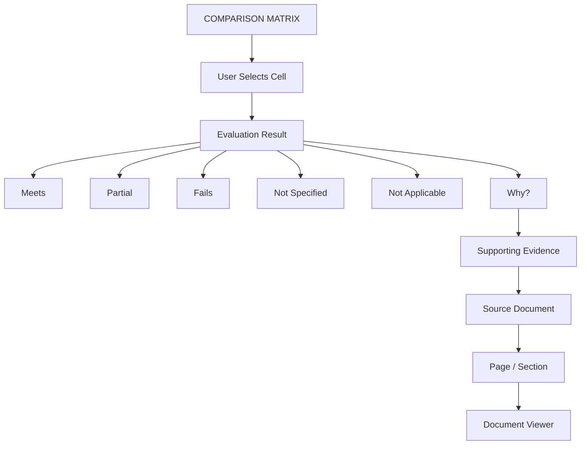

This creates the UX loop:

```text
Matrix
  ↓
Cell
  ↓
Why?
  ↓
Evidence
  ↓
Source
  ↓
Document
```

---

# 15 — Comparison Overview

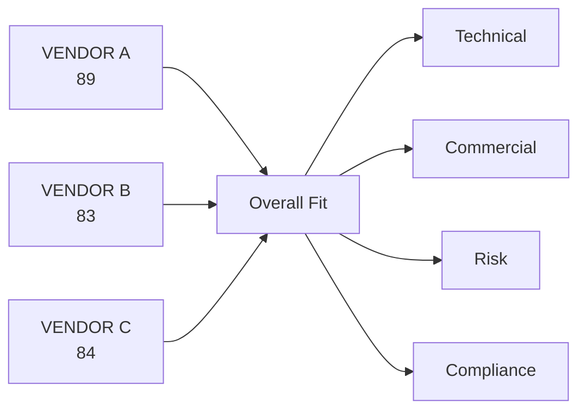

---

# 16 — Risk Experience

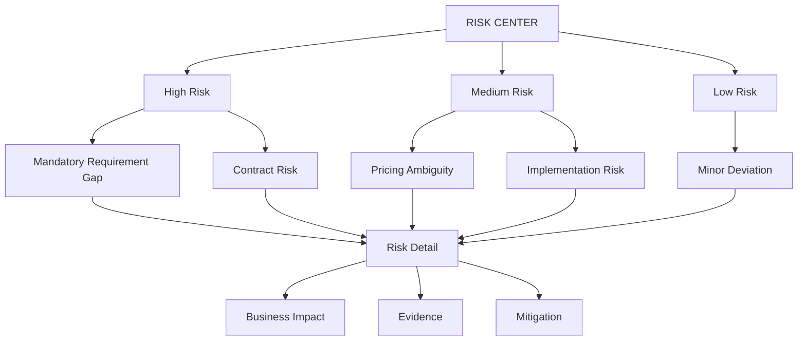

---

# 17 — Decision Experience

This should be a completely different UX from the comparison screen.

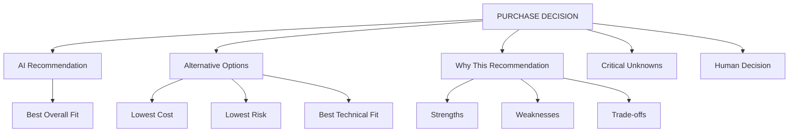

---

# 18 — Decision Brief

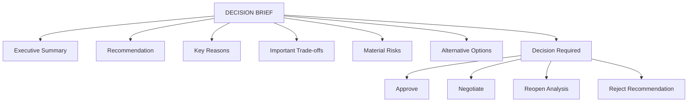

---

# 19 — Human Approval

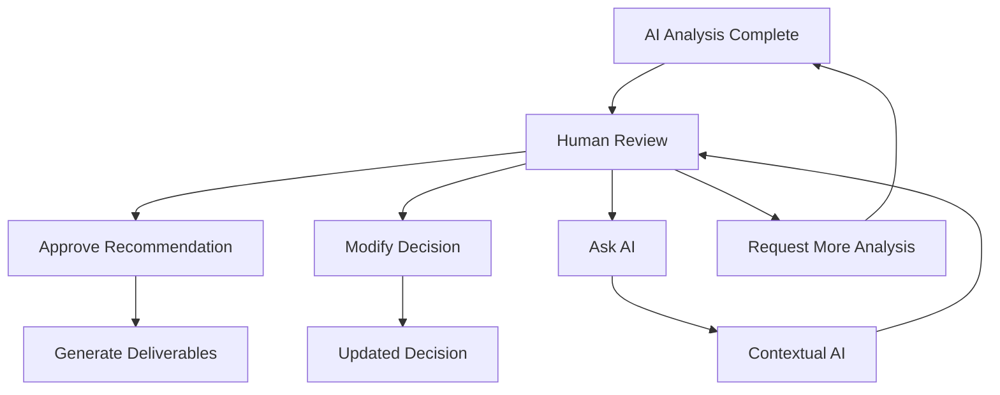

---

# 20 — AI Copilot Experience

The AI should change according to the current screen.

```mermaid
flowchart TD

    COPILOT["AI COPILOT"]

    COPILOT --> OVERVIEW["On Overview"]

    COPILOT --> REQUIREMENT["On Requirements"]

    COPILOT --> VENDOR["On Vendors"]

    COPILOT --> COMPARE["On Comparison"]

    COPILOT --> RISK["On Risk"]

    COPILOT --> DECISION["On Decision"]

    OVERVIEW --> Q1["What does this purchase involve?"]

    REQUIREMENT --> Q2["Which requirements are ambiguous?"]

    VENDOR --> Q3["What are Vendor B's weaknesses?"]

    COMPARE --> Q4["Why is Vendor A ranked first?"]

    RISK --> Q5["What are the highest risks?"]

    DECISION --> Q6["What could change the recommendation?"]
```

---

# 21 — Document Viewer + AI

```mermaid
flowchart LR

    DOCUMENTS["DOCUMENTS"]

    DOCUMENTS --> LIST["Document List"]

    LIST --> DOCUMENT["Document"]

    DOCUMENT --> VIEWER["Document Viewer"]

    VIEWER --> HIGHLIGHT["AI Highlight"]

    HIGHLIGHT --> CLAIM["Extracted Claim"]

    CLAIM --> REQUIREMENT["Mapped Requirement"]

    CLAIM --> VENDOR["Vendor Fact"]

    CLAIM --> EVIDENCE["Evidence"]

    EVIDENCE --> MATRIX["Comparison Matrix"]
```

This gives the user:

> **Document → highlighted evidence → requirement → comparison**

without leaving the workspace.

---

# 22 — Knowledge View

Keep this as a secondary UX.

```mermaid
flowchart TD

    KNOW["PROJECT KNOWLEDGE"]

    KNOW --> FACTS["Known Facts"]

    KNOW --> REQUIREMENTS["Requirements"]

    KNOW --> VENDORS["Vendors"]

    KNOW --> DOCUMENTS["Documents"]

    KNOW --> CONVERSATIONS["Conversations"]

    KNOW --> EVIDENCE["Evidence"]

    KNOW --> GRAPH["Explore Knowledge"]

    GRAPH --> RELATIONSHIPS["Relationships"]

    GRAPH --> SOURCES["Source Traceability"]
```

---

# 23 — Knowledge Graph Experience

```mermaid
flowchart TD

    PURCHASE["PURCHASE"]

    PURCHASE --> REQ["Requirement"]

    PURCHASE --> VENDOR["Vendor"]

    PURCHASE --> BUDGET["Budget"]

    REQ --> EVIDENCE["Evidence"]

    VENDOR --> RESPONSE["Vendor Response"]

    RESPONSE --> EVIDENCE

    EVIDENCE --> EVALUATION["Evaluation"]

    EVALUATION --> SCORE["Score"]

    SCORE --> DECISION["Decision"]

    DECISION --> RECOMMENDATION["Recommendation"]
```

The user can click:

```text
Vendor B
   ↓
SLA
   ↓
Requirement 14
   ↓
Failure
   ↓
Evidence
   ↓
Vendor_B_SLA.pdf
```

---

# 24 — Deliverables

```mermaid
flowchart TD

    DELIVER["DELIVERABLES"]

    DELIVER --> EXCEL["Comparison Matrix"]

    DELIVER --> PPT["Executive Presentation"]

    DELIVER --> SUMMARY["Decision Summary"]

    DELIVER --> RECORD["Purchase Decision Record"]

    EXCEL --> GENERATE_EXCEL["Generate / Regenerate"]

    PPT --> GENERATE_PPT["Generate / Regenerate"]

    SUMMARY --> GENERATE_SUMMARY["Generate"]

    RECORD --> FINAL["Final Approved Record"]
```

---

# 25 — Excel Experience

```mermaid
flowchart TD

    EXCEL["COMPARISON MATRIX"]

    EXCEL --> SUMMARY["Executive Summary"]

    EXCEL --> REQUIREMENTS["Requirement Matrix"]

    EXCEL --> TECHNICAL["Technical Comparison"]

    EXCEL --> COMMERCIAL["Commercial Comparison"]

    EXCEL --> RISK["Risk Assessment"]

    EXCEL --> SCORING["Scoring"]

    EXCEL --> EVIDENCE["Evidence References"]

    EXCEL --> EXPORT["Export Excel"]
```

---

# 26 — PPT Experience

```mermaid
flowchart TD

    PPT["EXECUTIVE PRESENTATION"]

    PPT --> OVERVIEW["Purchase Overview"]

    PPT --> NEED["Business Need"]

    PPT --> VENDORS["Vendor Landscape"]

    PPT --> COMPARISON["Vendor Comparison"]

    PPT --> COMMERCIAL["Commercial Analysis"]

    PPT --> RISK["Risk"]

    PPT --> TRADEOFF["Trade-offs"]

    PPT --> RECOMMEND["Recommendation"]

    PPT --> DECISION["Decision Required"]

    PPT --> EXPORT["Export Presentation"]
```

---

# 27 — Completed Purchase

```mermaid
flowchart TD

    APPROVED["PURCHASE APPROVED"]

    APPROVED --> DECISION_RECORD["Decision Record"]

    APPROVED --> EXCEL["Final Comparison Matrix"]

    APPROVED --> PPT["Final Presentation"]

    APPROVED --> KNOWLEDGE["Purchase Knowledge"]

    DECISION_RECORD --> HISTORY["Purchase History"]

    EXCEL --> HISTORY

    PPT --> HISTORY

    KNOWLEDGE --> FUTURE["Future Purchase Intelligence"]

    HISTORY --> FUTURE
```

---

# 28 — Complete Application Journey

This is the **one Mermaid diagram I would put at the top of the application design document**.

```mermaid
flowchart TD

    START["USER"]

    DASH["DASHBOARD"]

    NEW["NEW PURCHASE"]

    INTAKE["AI INTAKE"]

    CONTEXT["PURCHASE CONTEXT"]

    CLARIFY["AI CLARIFICATION"]

    READY["PURCHASE READINESS"]

    WORKSPACE["PURCHASE WORKSPACE"]

    UNDERSTAND["UNDERSTAND"]

    PREPARE["PREPARE"]

    COMPARE["COMPARE"]

    DECIDE["DECIDE"]

    DELIVER["DELIVER"]

    REQUIREMENTS["Requirements"]

    DOCUMENTS["Documents"]

    VENDORS["Vendors"]

    KNOWLEDGE["Project Knowledge"]

    MATRIX["Comparison Matrix"]

    RISKS["Risk Analysis"]

    BRIEF["Decision Brief"]

    APPROVAL["Human Approval"]

    EXCEL["Excel"]

    PPT["PPT"]

    COMPLETE["COMPLETED PURCHASE"]

    START --> DASH

    DASH --> NEW

    DASH --> WORKSPACE

    NEW --> INTAKE

    INTAKE --> CONTEXT

    CONTEXT --> CLARIFY

    CLARIFY --> READY

    READY --> WORKSPACE

    WORKSPACE --> UNDERSTAND
    WORKSPACE --> PREPARE
    WORKSPACE --> COMPARE
    WORKSPACE --> DECIDE
    WORKSPACE --> DELIVER

    UNDERSTAND --> REQUIREMENTS

    PREPARE --> DOCUMENTS
    PREPARE --> VENDORS
    PREPARE --> KNOWLEDGE

    REQUIREMENTS --> PREPARE

    DOCUMENTS --> KNOWLEDGE
    VENDORS --> KNOWLEDGE

    KNOWLEDGE --> COMPARE

    COMPARE --> MATRIX
    COMPARE --> RISKS

    MATRIX --> DECIDE
    RISKS --> DECIDE

    DECIDE --> BRIEF

    BRIEF --> APPROVAL

    APPROVAL --> DELIVER

    DELIVER --> EXCEL
    DELIVER --> PPT

    EXCEL --> COMPLETE
    PPT --> COMPLETE

    COMPLETE --> DASH
```

## The product experience in one line

```text
Dashboard
   ↓
Create Purchase
   ↓
Tell AI / Upload
   ↓
AI Understands
   ↓
Clarify
   ↓
Purchase Ready
   ↓
Workspace
   ↓
Requirements + Vendors + Documents
   ↓
Comparison
   ↓
Risk + Trade-offs
   ↓
Decision Brief
   ↓
Human Approval
   ↓
Excel + PPT
   ↓
Completed Purchase
```

The important UX decision here is that **the user moves through a purchase journey, not through a collection of AI features**. The graph, copilot, knowledge base, evidence viewer, and AI analysis appear exactly where they add value to that journey.

