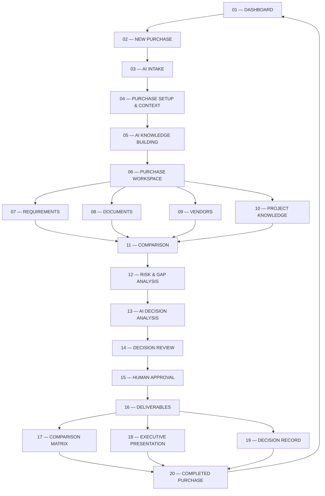
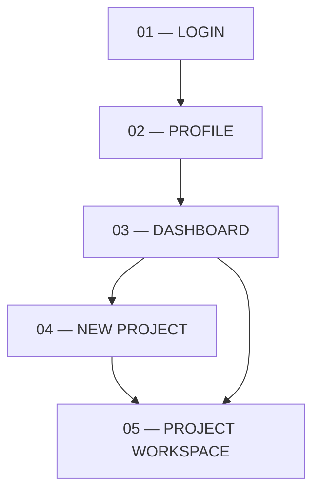
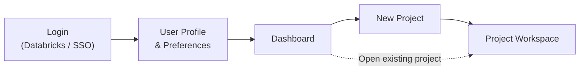

### Primary application flow

```text
Dashboard
    ↓
New Purchase
    ↓
AI Intake
    ↓
Purchase Setup & Context
    ↓
AI Knowledge Building
    ↓
Purchase Workspace
    ├── Requirements
    ├── Documents
    ├── Vendors
    └── Project Knowledge
            ↓
       Comparison
            ↓
    Risk & Gap Analysis
            ↓
    AI Decision Analysis
            ↓
      Decision Review
            ↓
      Human Approval
            ↓
       Deliverables
       ├── Comparison Matrix
       ├── Executive Presentation
       └── Decision Record
            ↓
    Completed Purchase
```

### Workspace navigation

```text
Purchase Workspace
│
├── Overview
├── Requirements
├── Documents
├── Vendors
├── Project Knowledge
├── Comparison
├── Risks & Gaps
├── Decision
└── Deliverables
```

**Core user journey:**

> **Discover → Understand → Prepare → Compare → Decide → Approve → Deliver**

## Flow 




But I would make one small UX adjustment:

### Profile should not necessarily be a mandatory step every time

If Databricks handles authentication, then:

```text
Login
  ↓
User Identity / Profile
  ↓
Dashboard
```

The **Profile page exists**, but after the first login the user should normally land directly on the Dashboard.

So the real experience is:



### Therefore, your application's **5 core pages** are:

```text
1. Login
    ↓
2. Profile
    ↓
3. Dashboard
    ↓
4. New Project
    ↓
5. Project Workspace
```

And from the Dashboard:

```text
Dashboard
│
├── New Project
│      ↓
│   Project Workspace
│
├── Active Projects
│      ↓
│   Existing Project
│
├── Completed Projects
│      ↓
│   Historical Project
│
└── Profile
```

This is the right **application shell**.

Then the complexity should live **inside `Project Workspace`**, rather than making the top-level application navigation complicated.

I would therefore treat:

> **Login → Profile → Dashboard → New Project → Project**

as the **Level-1 application flow**, and design the detailed procurement workflow as **Level-2 inside Project**.