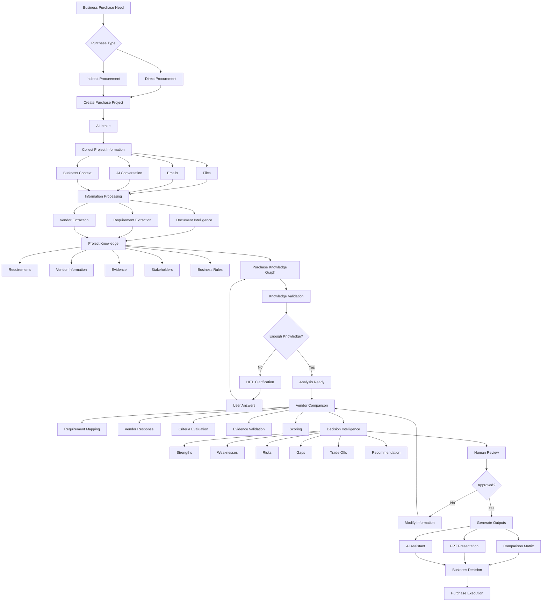
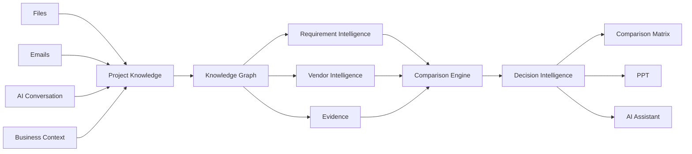

# Procure AI Workspace

> **AI-powered procurement workspace for transforming fragmented purchase information into a traceable, evidence-backed vendor decision.**

---

## 🎯 Final Goal: End-to-End Flow



### Core Architecture Concept



> **The product in one sentence:**  
> Multiple procurement inputs → one Purchase Knowledge Graph → AI-assisted comparison and decision intelligence → business-ready procurement outputs.

---

## 🚀 Sprint 1 Deliverables

### Goal
```text
Login Databricks SSO ➔ Profile Page ➔ Dashboard ➔ Chat Interface
```

### Deliverables Checklist

- [ ] **1. Deploy Databricks App** — Hosting & deployment configuration for the workspace app on Databricks
- [ ] **2. Flask App** — Core web application framework and API endpoints
- [ ] **3. User Table** — User model, persistence, and profile data structures
- [ ] **4. X-Forwarded Header Handling** — Secure proxy, Databricks SSO header & authentication forwarding
- [ ] **5. Telemetry** — Logging, metrics tracking, and observability
- [ ] **6. Chat Agent** — Conversational agent core & message routing
- [ ] **7. Model Registry** — Model registry integration and LLM endpoint configuration
- [ ] **8. Context Management** — Memory buffer, token budget, and conversation history
- [ ] **9. User Tools & MCP** — External integrations:
  - SharePoint
  - Outlook
  - OneDrive
  - User Memory
- [ ] **10. HITL (Human-in-the-Loop)** — User approval gates, clarifications, and feedback handling
- [ ] **11. Session Management** — Multi-turn session persistence and state recovery
- [ ] **12. Templates** — Standardized prompt templates and artifact output schemas
